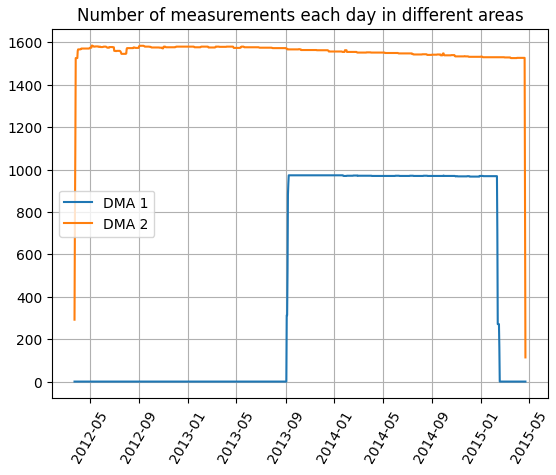

# Analyzing water comsuption using data from Yorkshire Water

Improving on a project that was a part of my data analysis studies.

Data consists of two files:

* [Daily customer meter data - local area study](https://datamillnorth.org/dataset/yorkshire-water-daily-customer-meter-data--local-area-) ([direct link](https://datamillnorth.org/download/yorkshire-water-daily-customer-meter-data--local-area-/fb01ce66-423a-4111-9065-d989bdf0b3ce/Daily%20m3%201315.csv))
* [Water usage survey](https://datamillnorth.org/dataset/water-usage-survey) ([direct link](https://datamillnorth.org/download/water-usage-survey/64ce97ab-3cdc-4afc-8202-a4d510f44962/Yorkshire%20Water%20consumer%20habits.csv))

The daily customer meter data contains water comsumption readings (in m3) from March 2013 (24th) to April 2015 (22nd). Additionally, data shows (anonymised) property identifier (1-2160), meter location (internal or external) and distribution management area (1 or 2).

As we can see from the graph below, readings from DMA 1 span a lot shorter time and they are fewer in number compared to readings from DMA 2.

<!-- <figure>

<figcaption>Figure 1</figcaption>
</figure> -->
